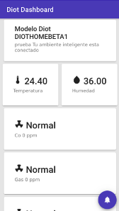

# Diot-ui is an progressive web app builded in angular 4 (Degree Project)

This is part of a smart alarm builded for my collage graduation proyect fill free an is open source proyect.




## Requirements
* Ionic 4
* Ionic-cli
* npm
* node

## Install
Instalar las dependencias del archivo package.json con:
``` bat
npm install
```
To launch the application in developer mode, change **mosquitto** host in enviroments.ts file to point the backend

``` js
export const environment = {
  production: false,
  api: "http://0.0.0.0:8000/",
  mosquitto_hostname:"0.0.0.0"
};
```

Once the enviroments are set up run:
``` bat
ionic serve
```
